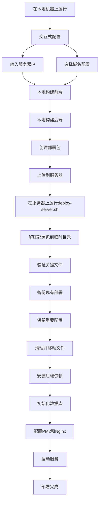
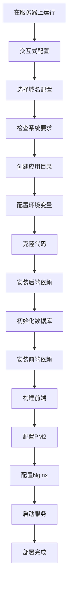

# 股票信息收集器 - 部署流程图

## 📋 部署模式对比

| 特性     | 本地编译上传模式 | 服务器编译模式   |
| -------- | ---------------- | ---------------- |
| 执行位置 | 本地机器         | 服务器           |
| 内存要求 | 低（本地构建）   | 高（服务器构建） |
| 网络依赖 | 需要上传         | 需要下载         |
| 适用场景 | 低内存服务器     | 高配置服务器     |
| 部署速度 | 快               | 中等             |

## 🔄 本地编译上传模式流程



### 详细步骤

1. **本地机器操作**

   - 运行 `./scripts/quick-deploy.sh --local-build`
   - 交互式输入服务器 IP 和域名
   - 本地构建前端（`frontend/dist/`）
   - 本地安装后端依赖并生成 Prisma 客户端
   - 创建部署包（排除 node_modules 等）

2. **服务器操作**
   - 自动上传部署包到服务器
   - 在服务器上运行 `deploy-server.sh`
   - 解压部署包到临时目录进行验证
   - 备份现有部署（保护数据）
   - 保留重要配置文件（.env、数据库）
   - 清理并移动文件到应用目录
   - 安装后端依赖
   - 初始化数据库（保留现有数据）
   - 配置 PM2（后端 API 服务）和 Nginx（前端静态文件服务）
   - 启动服务

## 🔄 服务器编译模式流程



### 详细步骤

1. **服务器操作**

   - 运行 `./scripts/quick-deploy.sh --server-build`
   - 交互式选择域名配置
   - 检查 Node.js、npm、PM2、Nginx
   - 创建应用目录和日志目录
   - 配置环境变量

2. **代码部署**

   - 克隆代码到服务器
   - 安装后端依赖
   - 初始化数据库
   - 安装前端依赖
   - 在服务器上构建前端

3. **服务配置**
   - 配置 PM2 进程管理
   - 配置 Nginx 反向代理
   - 启动应用服务
   - 验证部署状态

## 🎯 选择建议

### 选择本地编译上传模式的情况

- 服务器内存小于 2GB
- 服务器网络较慢
- 本地开发环境配置良好
- 需要快速部署

### 选择服务器编译模式的情况

- 服务器内存大于 2GB
- 服务器网络良好
- 需要完整的服务器端构建流程
- 服务器配置较高

## 🛠️ 命令对比

### 本地编译上传模式

```bash
# 在本地机器上运行
./scripts/quick-deploy.sh --local-build
```

### 服务器编译模式

```bash
# 在服务器上运行
./scripts/quick-deploy.sh --server-build
# 或
./scripts/quick-deploy.sh
```

## 📝 注意事项

1. **本地编译上传模式**

   - 必须在本地机器上运行
   - 需要 SSH 访问服务器权限
   - 本地需要 Node.js 环境

2. **服务器编译模式**

   - 必须在服务器上运行
   - 服务器需要足够内存
   - 需要网络连接下载依赖

3. **通用注意事项**
   - 两种模式都支持交互式配置
   - 都会自动备份现有部署
   - 都包含完整的服务配置

## 🔒 安全部署特性

### 数据保护

- **自动备份**：每次部署前自动备份现有部署
- **数据保留**：保留环境变量配置和数据库文件
- **回滚支持**：提供回滚脚本快速恢复之前版本

### 部署安全

- **临时目录**：在临时目录中验证部署包，避免污染
- **文件验证**：部署前验证关键文件完整性
- **权限管理**：正确设置文件权限和用户权限

### 迭代部署

- **增量更新**：只更新必要的文件，保留配置
- **服务连续性**：最小化服务中断时间
- **错误恢复**：部署失败时自动回滚机制

## 🛠️ 管理工具

### 回滚脚本

```bash
# 列出所有备份
./scripts/rollback.sh --list

# 回滚到最新备份
./scripts/rollback.sh --latest

# 回滚到指定备份
./scripts/rollback.sh --backup stock-info-collector.backup.20231201_143022
```

### 调试脚本

```bash
# 检查部署包内容
./scripts/debug-package.sh deploy-20231201_143022.tar.gz
```
